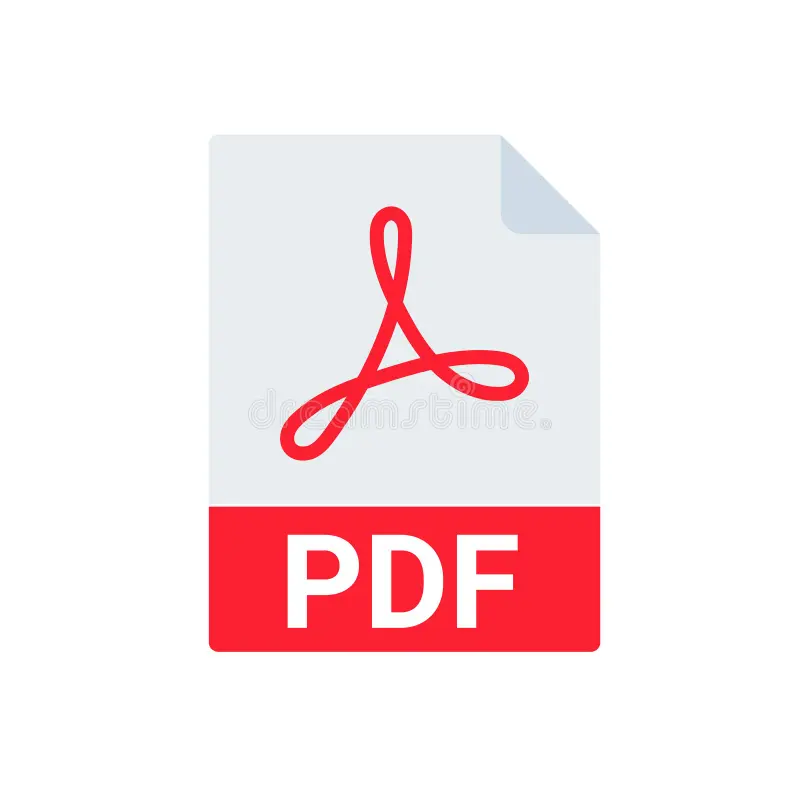
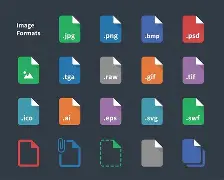

# Repozytorium Jakuba Muchy

Repozytorium do materiałów szkolnych.

---

## Spis treści

- [Prezentacje PowerPoint](#powerpoint)
- [Pliki tekstowe](#pliki-txt)
- [Arkusze kalkulacyjne](#arkusze-kalkulacyjne)
- [Pliki PDF](#pdf)
- [Pliki graficzne](#obrazy)

---

### PowerPoint

## Jak otworzyć pliki PowerPoint

Folder z prezentacjami znajduje się tutaj: [Prezentacje](Prezentacje/)

---

  
<strong>📖 Instrukcja otwierania prezentacji</strong>
 

  

    Aby otworzyć plik prezentacji, należy kliknąć w odnośnik <strong>PowerPoint</strong> powyżej.  
      

    Następnie wybierz interesującą Cię prezentację z listy plików:  
      

    Kliknij w przycisk <strong>View raw</strong>, aby otworzyć prezentację bezpośrednio w przeglądarce.  

    

      
        
<strong>Możesz również pobrać plik, klikając ikonę pobierania:</strong>

      
      
        
      
    
  

    Po otwarciu prezentacji możesz przechodzić między slajdami za pomocą strzałek <strong>lewo/prawo</strong>:  
    
  

---

### Pliki-txt

## Jak otworzyć pliki Tekstowe

Folder z plikami tekstowymi znajduje się tutaj: [Tekstowe](Tekstowe/)

---

  
<strong>Jak otworzyć pliki tekstowe</strong>

  

    Pliki tekstowe (np. DOCX, ODT) można otworzyć klikając ich nazwę w repozytorium.
  

  

  

    GitHub wyświetli podgląd dokumentu bezpośrednio w przeglądarce.
  

  

---

### Arkusze-Kalkulacyjne

## Jak otworzyć Arkusze Kalkulacyjne

Folder z Arkuszami Kalkulacyjnymi znajduje się tutaj: [Arkusze](Arkusze/)

---

  
<strong>Jak otworzyć arkusze kalkulacyjne</strong>

  

    Kliknij nazwę arkusza kalkulacyjnego (np. XLSX, ODS), aby zobaczyć jego zawartość.
  

  

  

    GitHub wyświetli zawartość arkusza bezpośrednio w przeglądarce.
  

  

---

### PDF

## Jak otworzyć Pliki PDF

Folder z PDF-ami znajduje się tutaj: [PDF](PDF/)

---

  
<strong>Jak otworzyć pliki PDF</strong>

  

    Kliknij nazwę pliku PDF, aby otworzyć go bezpośrednio w przeglądarce.
  

  

  

    Plik PDF otworzy się automatycznie w przeglądarce.
  

  

---

### Obrazy

## Jak otworzyć Pliki Graficzne

Folder z plikami: [Grafika](Grafika/)

---

  
<strong>Jak otworzyć pliki graficzne</strong>

  

    Kliknij nazwę pliku graficznego (np. JPG, PNG, GIF), aby wyświetlić obraz w przeglądarce.
  

  

  

    Obraz zostanie wyświetlony w pełnym rozmiarze.
  

  

---
